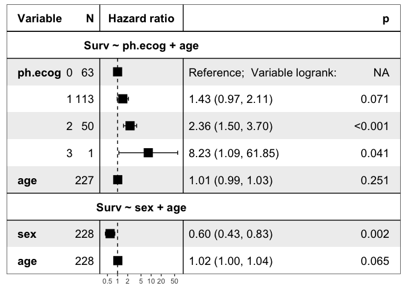

<!-- README.md is generated from README.Rmd. Please edit that file -->

# ezcox: Easily Process a Batch of Cox Models

<!-- badges: start -->

[](https://CRAN.R-project.org/package=ezcox)
[](https://cran.r-project.org/package=ezcox)
[](https://hits.seeyoufarm.com)

[](https://lifecycle.r-lib.org/articles/stages.html)
<!-- badges: end -->

The goal of ezcox is to operate a batch of univariate or multivariate
Cox models and return tidy result.

## :arrow_double_down: Installation

You can install the released version of ezcox from
[CRAN](https://CRAN.R-project.org) with:

``` r
install.packages("ezcox")
```

And the development version from [GitHub](https://github.com/) with:

``` r
# install.packages("remotes")
remotes::install_github("ShixiangWang/ezcox")
```

It is possible to install **ezcox** from Conda `conda-forge` channel:

``` r
conda install r-ezcox --channel conda-forge
```

Visualization feature of **ezcox** needs the recent version of
**forestmodel**, please run the following commands:

``` r
remotes::install_github("ShixiangWang/forestmodel")
```

## :beginner: Example

This is a basic example which shows you how to get result from a batch
of cox models.

``` r
library(ezcox)
#> Welcome to 'ezcox' package!
#> =======================================================================
#> You are using ezcox version 1.0.2
#> 
#> Project home : https://github.com/ShixiangWang/ezcox
#> Documentation: https://shixiangwang.github.io/ezcox
#> Cite as      : arXiv:2110.14232
#> =======================================================================
#> 
library(survival)

# Build unvariable models
ezcox(lung, covariates = c("age", "sex", "ph.ecog"))
#> => Processing variable age
#> ==> Building Surv object...
#> ==> Building Cox model...
#> ==> Done.
#> => Processing variable sex
#> ==> Building Surv object...
#> ==> Building Cox model...
#> ==> Done.
#> => Processing variable ph.ecog
#> ==> Building Surv object...
#> ==> Building Cox model...
#> ==> Done.
#> # A tibble: 3 × 12
#>   Variable is_cont…¹ contr…² ref_l…³ n_con…⁴ n_ref    beta    HR lower…⁵ upper…⁶
#>   <chr>    <lgl>     <chr>   <chr>     <int> <int>   <dbl> <dbl>   <dbl>   <dbl>
#> 1 age      FALSE     age     age         228   228  0.0187 1.02    1       1.04 
#> 2 sex      FALSE     sex     sex         228   228 -0.531  0.588   0.424   0.816
#> 3 ph.ecog  FALSE     ph.ecog ph.ecog     227   227  0.476  1.61    1.29    2.01 
#> # … with 2 more variables: p.value <dbl>, global.pval <dbl>, and abbreviated
#> #   variable names ¹​is_control, ²​contrast_level, ³​ref_level, ⁴​n_contrast,
#> #   ⁵​lower_95, ⁶​upper_95

# Build multi-variable models
# Control variable 'age'
ezcox(lung, covariates = c("sex", "ph.ecog"), controls = "age")
#> => Processing variable sex
#> ==> Building Surv object...
#> ==> Building Cox model...
#> ==> Done.
#> => Processing variable ph.ecog
#> ==> Building Surv object...
#> ==> Building Cox model...
#> ==> Done.
#> # A tibble: 4 × 12
#>   Variable is_cont…¹ contr…² ref_l…³ n_con…⁴ n_ref    beta    HR lower…⁵ upper…⁶
#>   <chr>    <lgl>     <chr>   <chr>     <int> <int>   <dbl> <dbl>   <dbl>   <dbl>
#> 1 sex      FALSE     sex     sex         228   228 -0.513  0.599   0.431   0.831
#> 2 sex      TRUE      age     age         228   228  0.017  1.02    0.999   1.04 
#> 3 ph.ecog  FALSE     ph.ecog ph.ecog     227   227  0.443  1.56    1.24    1.96 
#> 4 ph.ecog  TRUE      age     age         228   228  0.0113 1.01    0.993   1.03 
#> # … with 2 more variables: p.value <dbl>, global.pval <dbl>, and abbreviated
#> #   variable names ¹​is_control, ²​contrast_level, ³​ref_level, ⁴​n_contrast,
#> #   ⁵​lower_95, ⁶​upper_95
```

``` r
lung$ph.ecog = factor(lung$ph.ecog)
zz = ezcox(lung, covariates = c("sex", "ph.ecog"), controls = "age", return_models=TRUE)
#> => Processing variable sex
#> ==> Building Surv object...
#> ==> Building Cox model...
#> ==> Done.
#> => Processing variable ph.ecog
#> ==> Building Surv object...
#> ==> Building Cox model...
#> ==> Done.
mds = get_models(zz)
str(mds, max.level = 1)
#> List of 2
#>  $ Surv ~ sex + age    :List of 19
#>   ..- attr(*, "class")= chr "coxph"
#>   ..- attr(*, "Variable")= chr "sex"
#>  $ Surv ~ ph.ecog + age:List of 22
#>   ..- attr(*, "class")= chr "coxph"
#>   ..- attr(*, "Variable")= chr "ph.ecog"
#>  - attr(*, "class")= chr [1:2] "ezcox_models" "list"
#>  - attr(*, "has_control")= logi TRUE

show_models(mds)
```



## :star2: Vignettes

- [ezcox: Easily Process a Batch of Cox
  Models](https://CRAN.R-project.org/package=ezcox/vignettes/ezcox.html)
- [ezcox: Easily Show Cox Forestplot in One
  Command](https://CRAN.R-project.org/package=ezcox/vignettes/ezforest.html)
- [ezcox: Easy Group Cox Analysis and
  Visualization](https://CRAN.R-project.org/package=ezcox/vignettes/ezgroup.html)
- [ezcox: an R Package for Cox Model Batch Processing and
  Visualization - An Use
  Case](https://shixiangwang.github.io/ezcox-adv-usage/)

## :page_with_curl: Citation

If you are using it in academic research, please cite the preprint
[arXiv:2110.14232](https://arxiv.org/abs/2110.14232) along with URL of
this repo.
